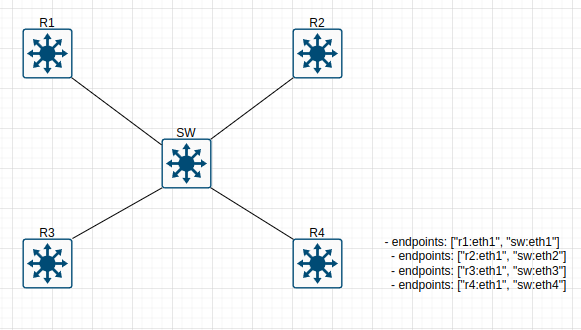
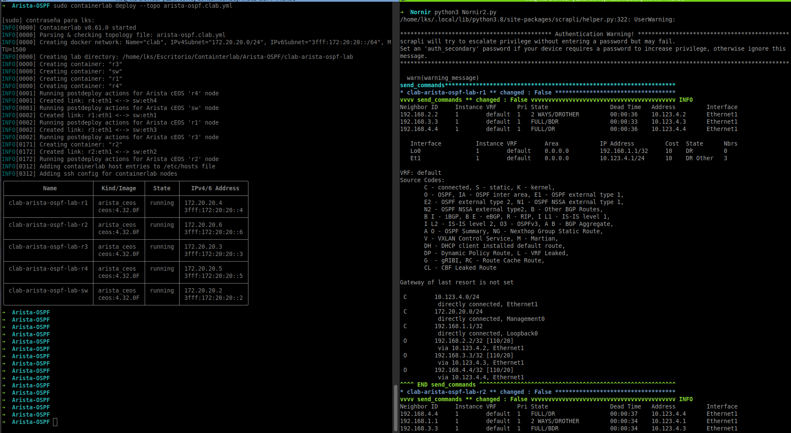

# Containerlab-Nornir-Arista

This project combines **Containerlab** and **Nornir** to implement and automate an **OSPF** lab using Arista Devices. It also allows using Nornir to retrieve information (e.g., show commands) or modify the configuration. The combination of these tools is very powerful: with just two commands, you can deploy the entire lab and gather OSPF information.
You can modify the commands used in Nornir2.py to customize the output you want. Note that the Arista devices come with predefined startup configurations, which can be edited inside the Containerlab/Arista-OSPF/r*/startup-config files. It is mandatory to maintain the SSH configurations in these files to allow Nornir to connect to the devices.. 

## Project directory

```plaintext
.
├── Containerlab
│   └── Arista-OSPF
│       ├── arista-ospf.clab.yml
│       └── configs
│           ├── r1
│           │   └── startup-config
│           ├── r2
│           │   └── startup-config
│           ├── r3
│           │   └── startup-config
│           └── r4
│               └── startup-config
├── LICENSE
├── Nornir
│   ├── config.yaml
│   ├── groups.yaml
│   ├── hosts.yaml
│   ├── Nornir1.py
│   └── Nornir2.py
└── README.md

```
## Topology



## Features

- Automated configuration of network devices using Nornir.
- Simulated lab using Containerlab to deploy Arista devices.
- Initial OSPF configuration across multiple routers.
- Customizable commands for information retrieval and configuration changes.

## Requirements

- [Docker](https://docs.docker.com/get-docker/)
- [Containerlab](https://containerlab.dev/)
- [Python 3.8+](https://www.python.org/)
- Python libraries:
  - `nornir`
  - `nornir_scrapli`
  - `scrapli`
  - Arista requires its users to register with arista.com before downloading any images. Once you created an account and logged in, go to the software downloads section and download ceos64 tar archive for a given release.
    Once downloaded, import the archive with docker:
    **import container image and save it under ceos:4.32.0F name**
        docker import cEOS64-lab-4.32.0F.tar.xz ceos:4.32.0F

## Instalation

1. **Clone the repository:**

   git clone https://github.com/lucaperyraluca/Containerlab-Nornir-Arista.git
   cd Containerlab-Nornir-Arista

2. **Configure network enviroment:**

   Execute the file arista-ospf.clab.yml with Containerlab:
   containerlab deploy -t Containerlab/Arista-OSPF/arista-ospf.clab.yml

3. **Configure and execute Nornir to check devices:**

   You need to update the file hosts.yaml and replace the IPs with the correct ones. The IPs for each device are assigned automatically by Containerlab and are displayed after running the following command: "containerlab deploy -t Containerlab/Arista-OSPF/arista-ospf.clab.yml".
   Once you have updated these parameters (IPs), you can modify the commands used to retrieve information. By default, the following commands are configured in Nornir2.py:
   commands = ["show ip ospf nei", "show ip ospf interface brief", "show ip route"] You can replace these commands with any others as needed.


## Example



